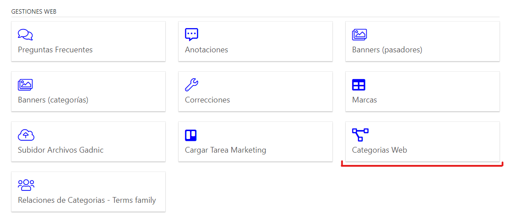
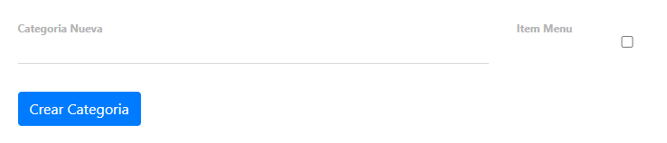

# Info de Categorias
[Volver](marketing)

## Crear una nueva Categoría
1. Categorías Web, dentro de Gestión Web

2. Ingresar el nombre de la nueva categoría.

`Si no va a tener otra categoría como padre, se debe dar check en 'item_menu'`

3. Actualizar en Mongo

Para que estos cambios impacten en la página de Bidcom, se debe actualizar la base de datos de mongo, si no se sabe como hacerlo, consultar con Kevin, Andy o Meme.