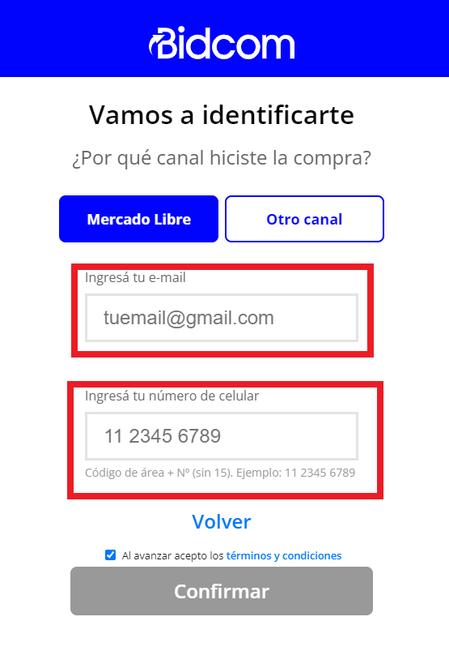
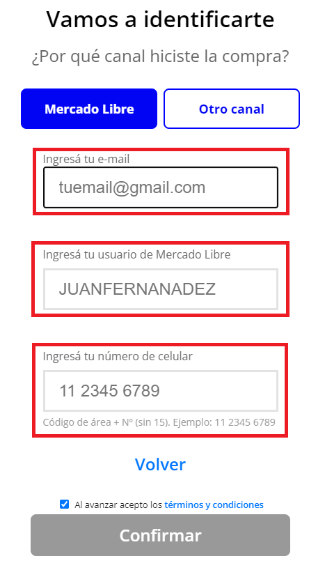
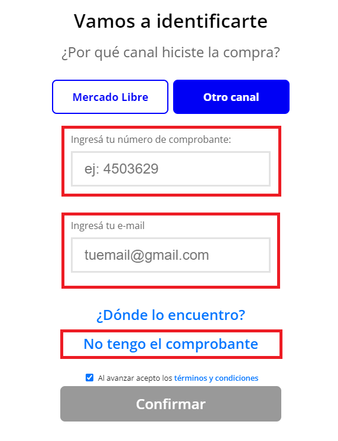
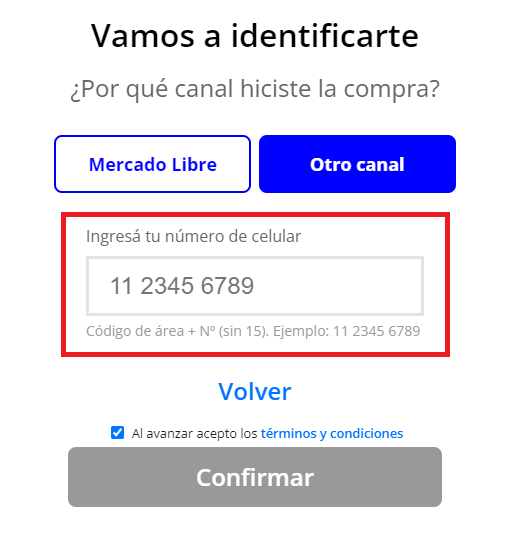
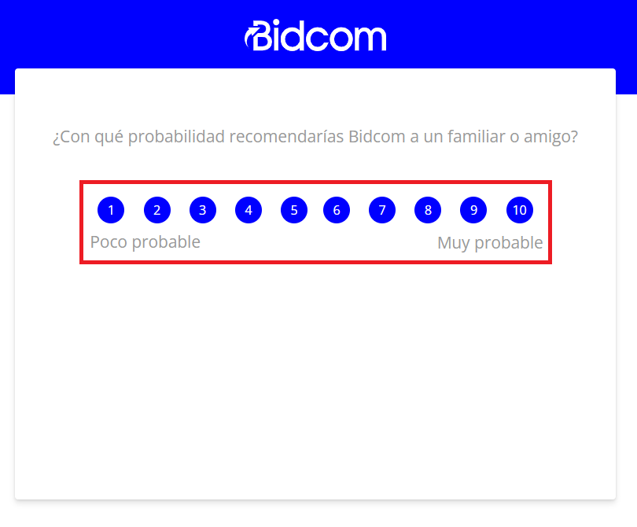
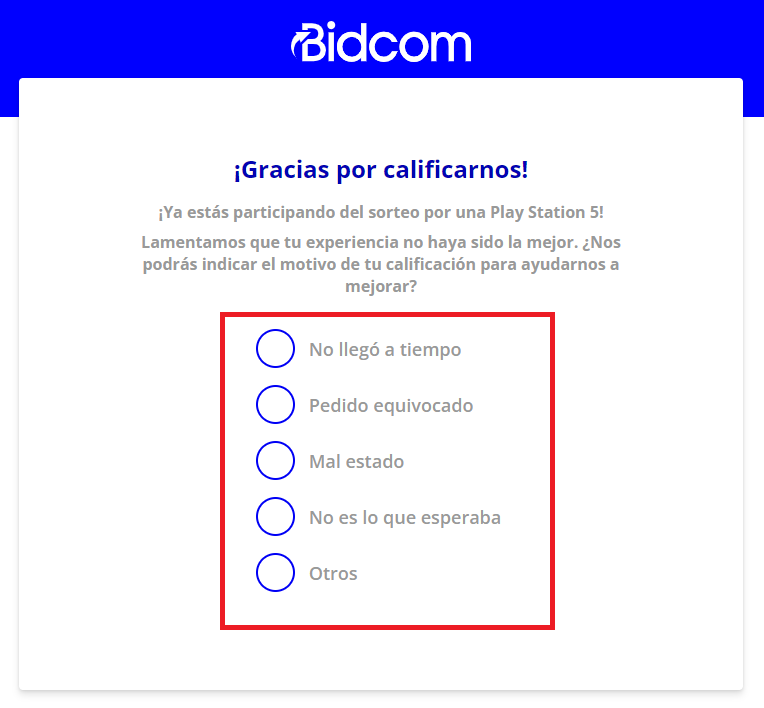
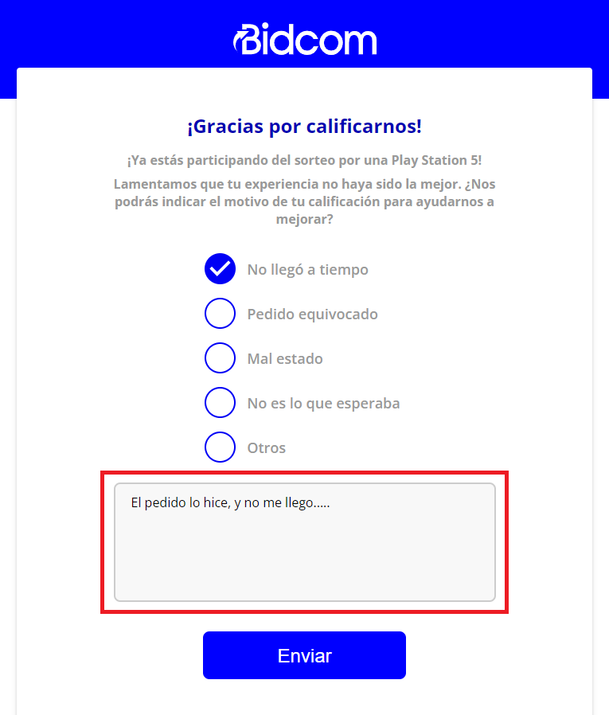
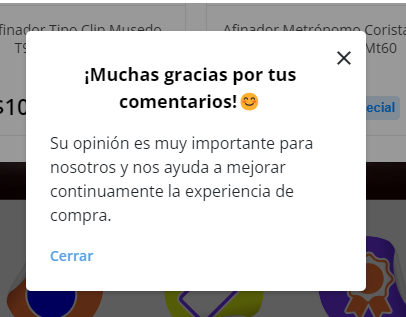
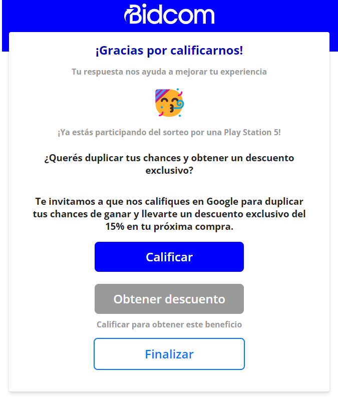

# Manual de uso de los pasadores

[Volver](marketing)

## Proyecto Sofia 

El proyecto Sofia es un proyecto que se esta llevando a cabo en la empresa, que tiene como principal objetivo poder conocer la experiencia de compra de los clientes, y asi mismo poder mejorarla. Es por eso que los medios que tiene el cliente para poder expresar su experiencia de compra, y cuan conforme esta con esta, es por medio de las encuentas, que puede acceder por diferentes medios. 

El proceso de calificacion en el Proyecto Sofia cuenta con varias aristas y varios aspectos variables a considerar. Es por eso que se creo esta documentacion, separando la totalidad del proceso en 3 pasos: 

 - 1) Proceso de carga de datos
 - 2) Proceso de validacion de datos
 - 3) Proceso de calificacion

## Proceso de carga de datos

El proceso de carga de datos en el Proyecto Sofia cuenta con varias aristas y variantes a considerar. Pero, en escencia, el proceso de carga de datos, se valida que se haya realizado una compra de algun producto, y que la persona que este realizando la calificacion, sea la misma que realizo la compra.

En principio, podemos mencionar que las compras de los productos en Bidcom, pueden venir por dos medios: Por MercadoLibre o por las paginas de Bidcom y/o Gadnic.
Independientemente del lugar por donde se compre, hay algo que tenemos que tener en cuenta, y es que el envio del paquete tiene un codigo QR para poder ser escaneado por el cliente, y asi poder acceder a la calificacion de la compra.

Una vez escaneado ese codigo QR, el cliente podra acceder a la pagina de [califica y gana](https://www.bidcom.com.ar/califica-y-gana), en donde podra cargar los datos personales como su celular y su correo electronico, junto con el comprobante de compra, y una vez validados, podra acceder a la calificacion su experiencia de compra y participar del sorteo. 

Es por eso que una vez llegado a este paso, hay dos posibilidades de calificacion: 
 - 1) Canal de compra por MercadoLibre
 - 2) Canal de compra por Bidcom y/o Gadnic

### Canal de compra por MercadoLibre

En el caso de que el usuario haya hecho la compra por el medio de MercadoLibre, debera seleccionar ese canal de compra en la view /comenzar-calificacion. 

Una vez seleccionado este medio de compra, debera a comenzar a llenar ciertos datos como los son el numero de comprobante, y tambien su nickname de MercadoLibre. En el caso de no tener comprobante, hay un boton destinado para ese caso, por lo que al presionarlo, se le pedira otros datos como lo son su email, su nombre de usuario de MercadoLibre, y tambien su numero de celular. Pero de eso hablaremos en el apartado de "Compre por MercadoLibre y no tengo comprobante".

Una vez entonces cargados el numero de comprobante y el usuario de MercadoLibre, seras redigirido a la segunda seccion de ingresos de datos. 
Pero en esta ocacion se deberan ingresar dos datos como lo son el email, y el numero de celular.

### Compre por MercadoLibre y no tengo comprobante

En el caso de que en el proceso de calificacion sea por el medio de Mercado Libre, y el usuario no tenga el comprobante de compra, debera seleccionar el boton de "No tengo comprobante".

Una vez seleccionado ese boton, se le pedira al usuario que ingrese ciertos datos en forma de alternativa, como lo son el email, el usuario de Mercado Libre, y el numero de celular. 

Una vez ingresados esos datos, se validara que los datos ingresados sean correctos, y comenzara el proceso de validacion de los datos ingresados.

### Canal de compra por Bidcom y/o Gadnic

En el caso de que el usuario haya hecho la compra por la pagina de Bidcom, por la pagina de Gadnic, o por venta telefonica, debera seleccionar ese canal de compra en la view /comenzar-calificacion.

Una vez seleccionado este medio de compra, debera a comenzar a llenar ciertos datos como los son el numero de comprobante, y tambien su email. En el caso de no tener comprobante, hay un boton destinado para ese caso, por lo que al presionarlo, se le pedira otros datos como lo son su email, su nombre de usuario de MercadoLibre, y tambien su numero de celular. Pero de eso hablaremos en el apartado de "Compre por Otro Canal y no tengo comprobante".

Una vez entonces cargados el numero de comprobante y el email, seras redigirido a la segunda seccion de ingresos de datos.
Pero en esta ocacion sera necesario poder ingresar el numero de celular.

### Compre por Otro Canal y no tengo comprobante

En el caso de que en el proceso de calificacion sea por el medio de Mercado Libre, y el usuario no tenga el comprobante de compra, debera seleccionar el boton de "No tengo comprobante".

Una vez seleccionado ese boton, se le pedira al usuario que ingrese ciertos datos en forma de alternativa, como lo son el email, y el numero de celular.

## Proceso de validacion de datos

Una vez cargado esos datos, internamente, en el sistema, se estaria validando los siguientes factores: 
 - 1) Que el numero de comprobante sea valido.
 - 2) Que el usuario de MercadoLibre sea valido.
 - 3) Que el periodo de prueba tenga un rango de 90 dias. 
 - 4) Que no haya una calificacion para ese mismo numero de comprobante. 

En el caso de que alguno de estos factores no se cumpla, se le mostrara un mensaje de error al usuario, en el cual se le explicara cual es el problema que tiene al intentar realizar la calificacion. 

En el caso contrario, si se cumplen todos los requisitos mencionados anteriormente, el usuario sera redirigido al siguiente paso, en donde ya comenzaria con la calificacion en si. 

## Proceso de calificacion

Una vez que el usuario haya pasado el proceso de validacion de datos, estara en condiciones de poder avanzar con el proceso de calificacion. Este proceso de calificacion esta separado segun la calificacion que el usuario ingrese. 

Es por eso que en primera instancia, se le mostrara al usuario la numeracion de la escala de calificacion, en el rango del 1 al 10, en donde el 1 es la peor calificacion, y el 10 es la mejor calificacion.

Entonces al usuario se le planteara la pregunta de "¿Con qué probabilidad recomendarías Bidcom a un familiar o amigo?" y se le mostrara la escala de calificacion.

Una vez elegida una escala de valor, el sistema analizara la puntuacion asignada al proceso de compra, y dependiendo de la calificacion, se le mostrara al usuario diferentes vistas. 

El proceso de clasificacion de las puntuaciones, es la siguiente: 
 -  Si la calificacion se encuentra entre el rango de 1 a 6, se considerara una calificacion negativa.
 -  Si la calificacion se encuentra entre el rango de 7 a 10, se considerara una calificacion positiva. 

### Calificacion Negativa

En el caso de que se haya seleccionado una calificacion negativa, se le mostrara al usuario una vista en donde se le pedira que ingrese una breve descripcion de porque considera que la calificacion es negativa. Una de las premisas que tiene el Proyecto Sofia, es que el usuario pueda expresar su experiencia de compra, y asi poder mejorarla. Es por eso que se le pedira que seleccione algunos de los motivos sugeridos por los cuales considera que la calificacion es negativa.

Una vez seleccionado algunos de los motivos negativos, se desplegara un recuadro de libre comentarios, en donde el usuario podra comenzar a dar mas detalles sobre su experiencia de compra.

Una vez llenado el formulario de calificacion negativa, se guardara en la base de datos la calificacion, y se le mostrara al usuario un modal con el mensaje de agradecimiento por haber participado de la calificacion.

### Calificacion Positiva

En el caso de que la calificacion sea positiva, es decir, haya sido de 7 a 10, se le mostrara al usuario una vista en donde se le comunicara que ya esta participando del sorteo, pero que tiene la posibilidad de aumentar sus chances de ganar, con la condicion de que tambien de su reseña positiva en Google (si se realizo la compra por Otro Canal) o en MercadoLibre (si se realizo la compra por MercadoLibre), dependiendo del canal de compra que haya seleccionado.

Es por eso que hay disponibles tres botones en la view. 
El boton de calificar, llevaria al usuario a la pagina de Google o MercadoLibre, dependiendo del canal de compra, en donde podra dejar su reseña positiva.

El boton de "Obtener descuento", en una primera instancia, estaria totalmente deshabilitado, pero una vez que el usuario haya dejado su reseña positiva, y retorne a la pagina de calificacion, se habilitara el boton, y al presionarlo, se le mostrara un modal con un codigo de descuento para su proxima compra.

En el caso del boton de "Finalizar", se le mostrara al usuario un modal con el mensaje de agradecimiento por haber participado de la calificacion.

### Boton de "Calificar"

En el caso de que presione el boton de "Calificar", se le mostrara al usuario un modal en donde se le explicara como es el proceso de calificacion en Google o MercadoLibre, dependiendo del canal de compra.

En ese caso, luego de hacer la calificacion, se le mostrara al usuario un modal con el mensaje de agradecimiento por haber participado de la calificacion. Y, en este paso si, se le habilitara el boton de "Obtener descuento".

### Boton de "Obtener descuento"

Una vez realizado la calificacion en Google o MercadoLibre, dependiendo del canal de compra, se le habilitara al usuario, el boton de "Obtener descuento".

Una vez presionado ese boton, se le mostrara al usuario un modal con un codigo de descuento para su proxima compra.
Ese cupon de descuento, estaria asignado al email, con el que hizo la calificacion, y tendria una duracion de 30 dias. El descuento se aplicaria a la totalidad de la compra, y se aplicara un 15% de descuento. 

### Boton de "Finalizar"

En el caso de que el usuario haya seleccionado el boton de "Finalizar", se le mostrara al usuario un modal con el mensaje de agradecimiento por haber participado de la calificacion. La particularidad de este caso, es que por no haber realizado la calificacion en Google o MercadoLibre, no se le habilitara el boton de "Obtener descuento", por lo que no tendra un cupon de descuento del 15% de descuento para su proxima compra.

## Enlaces que pueden ser de utilidad

- [Miro](https://miro.com/welcomeonboard/WEtkM3pYT2VBYWZVRFlpVVlDcWhNVHZNTlZhS2N1MkRTUXJmNjQ3Y2pJcGhmbFl4cFZPQkhmUVBmYlM1MmZHMXwzNDU4NzY0NTQ4Njc0MjAxOTY0fDI=?share_link_id=129890493172)
- [Sheet Pruebas](https://docs.google.com/spreadsheets/d/1rObq5Apk9f2j6FCKXapfgiX5fdgNSruFcFuol4zj7wI/edit#gid=0)
- [Enlaces automatizados](https://docs.google.com/spreadsheets/d/1qe10_7SatO7_JVFUp24evy1tu8RsrEYC77XHlbWP6eQ/edit#gid=1772868733)