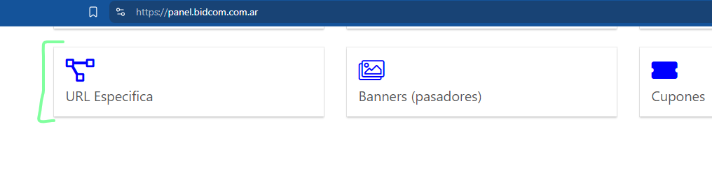
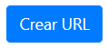

# **URL Específica 📑**
[Volver](/index)

## **1. URL Específica para Banners**

### **1.1. Descripción**
Si la necesidad es crear una nueva url para utilizar en los banners, se debería seguir los siguientes pasos.

1. Incresar al panel de administración: https://panel.bidcom.com.ar/ e ingresar al menu de "URLs Específica".

2. Seleccionar la opción de "Nueva URL Específica".

3. Como nuesta funcionalidad solo abarcaría la creación de una nueva URL.

::: warning Campos Obligatorios
`Título` y `URL`.
:::

::: info Campos Opcionales
Estos campos se ajustarían a la necesidad del caso: `Título meta Bidcom`, `Título meta Gadnic`, `Descripción meta Bidcom`, `Descripción meta Gadnic` 
:::

4. Una vez completados los campos, se deberá seleccionar el botón de "Guardar".

    

::: tip 
Para generar una url específica y poder utilizarla en banners no se nececsita nada más.
:::

## **1.2. URL Específica para Landing Page**
Proximamente...