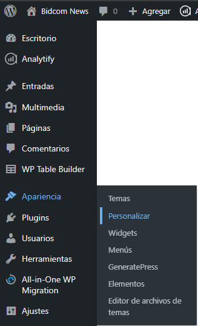
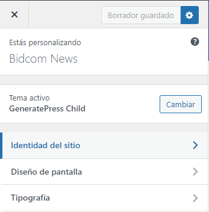
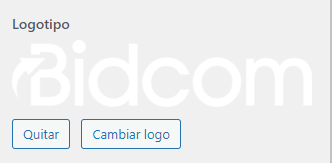
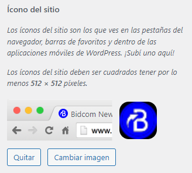

# WordPress info
[Volver](marketing)

## URL para acceder a editar la info
[WordPress Admin](https://noticias.bidcom.com.ar/wp-admin/)

## Actualizar Logo y Favicon
1. Ir a Apariencia->Personalizar

2. Click en Identidad del Sitio

3. Reemplazar Logo

4. Reemplazar favicon

